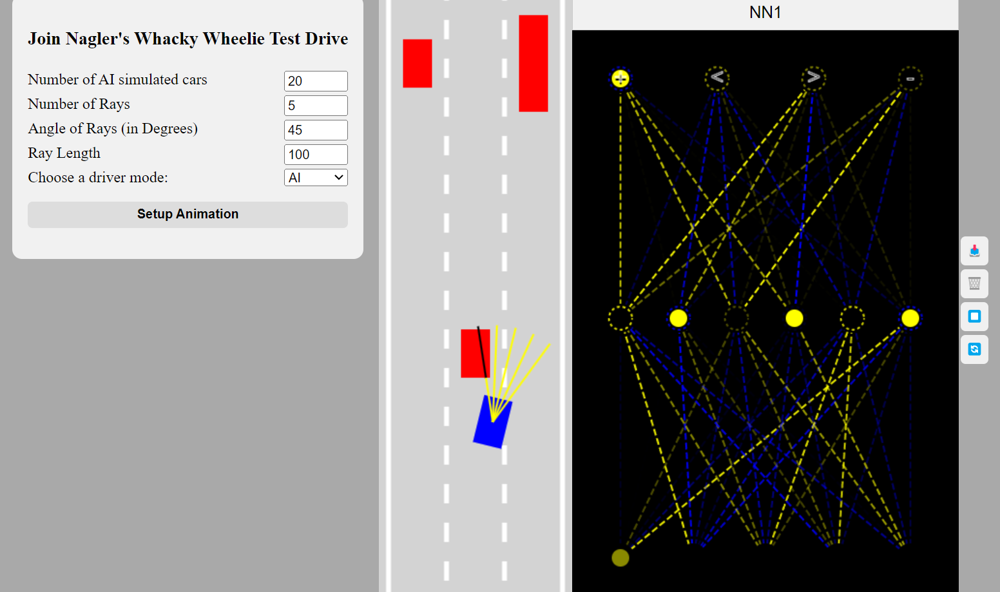
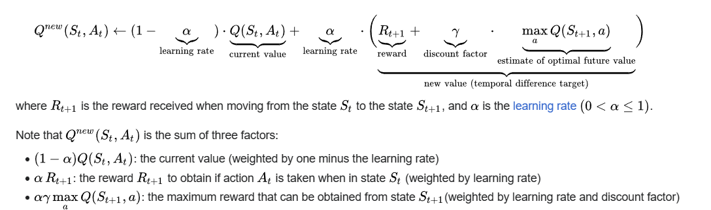

# Introduction into self-driving cars

This project is an introduction into self-driving cars developed in JavaScript. Its purpose is to demonstrate how simple feedforward neural networks can autonomously navigate an obstacle course without sustaining damage.
With little intervention by the user in assisting / evaluating the models performance, it is able to learn rapidly and thereby gives you a first understanding into the topic of Reinforcement Learning.



## Features
- Interactive web-based application to play and learning
- Live visualization of the neural networks signals
- Configurable settings (neural network structure, traffic, sensors etc.) - See the learning effects yourself
- Switch between car control types: Keys or different neural networks.
- Prebuilt connector from a JavaScript frontend to a Python backend using [Axios](#) and [Flask](#) (WIP) - Currently on feature branch "feature/pybackend". Unstable because of API requests limiations (inferiror performance atm).

## Getting Started

Move to desired project folder and clone the repo:
```bash
cd your_project_folder
git clone https://github.com/g-noth/intro-self-driving-cars.git
cd intro-self-driving-cars
```
Before running the project, you need to install the required dependencies. Run the following command to install the necessary libraries using the provided YAML file.

Using pip:

```bash
pip install -r environment.yaml
```

Using conda:
```bash
conda create -f environment.yaml
conda activate intro-self-driving-cars-venv
```

Start the application:

1) Start Frontend and Backend manually:
- Recommended: Install the VS Code extension [Live Server](https://marketplace.visualstudio.com/items?itemName=ritwickdey.LiveServer) to launch a local development server for live visualization.
- Right-click index.html and choose "Open with Live Server" in the directory. Have fun!
- Go to the backend folder and start the flask server by:
```bash
python neural_network.py
```
or

2) Start the entire application (frontend + backend) with npm start:
```bash
cd frontend
npm i
npm start
```

## How it works

### Frontend

The canvas element is used to create 2d animations (the canvas element is a container to draw graphics with JavaScript). Learn more: https://www.w3schools.com/html/html5_canvas.asp 


Car.js is required to build/draw each car. The rotated Unit circle is used to move the car smoothly (not just jump from lane to lane)

Control.js is used to control the car either manually or via the Neural network outputs (left,right, forward, back)

Road.js creates the road and it draws the borders respectively to detect if the car crashes against the border (Hint: the main car is not really moving, just everything else)

Sensor.js defines rayCasts and the intersection helper function in utils.js returns the offset

Class main.js initializes everything

### Backend

The architecture of the neural network is defined by the `NeuralNetwork` class, which initializes the network with a specified number of neurons in each layer (output layer always has 4 nodes).

Input data = Sensor readings as an array the length of the ray/sensor count (one offet value per sensor ray)
- given_inputs[0] = Distance to the closest obstacle detected by the first ray (leftmost)
- given_inputs[1] = Distance to the closest obstacle detected by the second ray
- given_inputs[2] = Distance to the closest obstacle detected by the third ray
- given_inputs[3] = Distance to the closest obstacle detected by the fourth ray
- given_inputs[n] = Distance to the closest obstacle detected by the fifth ray (rightmost)

Output = Car controls as an array
 - outputs[0] = Forward 
 - outputs[1] = Left
 - outputs[2] = Right
 - outputs[3] = Reverse

The outputs determine the car's behaviour through an update method in each frame.

We employ a unidirectional / feedforward neural network (no backpropagation because we can not define expected results!) at this time.
- Calculate the weighted sum of the inputs (dot product)
- Binary step function (1 if weighted sum > bias, 0 otherwise) - sufficient because of no backprop
- One data point at a time


#### Neural Network Visualization


**How does it learn the path?**

We parallelize and speed up the learning process by intializing `N` amount of `AI` cars with totally random weights and biases. 

**Fitness function**: Out of all cars in an epoch, find the bestCar, that reaches the highest point on the screen (lowest y value - see Unit Circle). Hence travelled the longest distance without damage.

$$bestCar = cars.find(c \rightarrow c.y = min(cars.map(c \rightarrow c.y)))$$

Where:
- $cars.find$ is a function that searches for an element in the list of cars.
- $c.y$ represents the y coordinate of car $c$
- $min(cars.map(c \rightarrow c.y))$ calculates the minimum y value among all cars in an epoch

**Evaluation (& Mutation) time!**

If you are happy with the behaviour of that bestCar, save it in LocalStorage. 

In the next generation (epoch) this bestCars' "brain" / set of weights and biases are `mutated` by a specified amount ($0 < a \leq 1$). The closer to 0 the more similar the new initalized neural networks are to the current bestCar.

This is achieved by linear interpolation ($lerp$) with some random variation. We adjust weights and biases in the next generation by calculating a value that is amount `a` of the way from the current bias or weight to the new random value.

$$lerp(A,B,a) = A + (B-A)*a$$

Where:
- $A$ is the starting value (current value saved in bestCar)
- $B$ is the ending value (upper and lower bounds 1 and -1)
- $a$ is the interpolation factor, ranging from 0 to 1, where 0 corresponds to A (biases and weights stay the same) and 1 corresponds to B (completely new random weights and biases)

This is similar approach to the practice in **Reinforcement Learning**!
- Current state only depends on previous state (see Markow Decision Process (MDP))
- Exploration and Exploitation Trade-Off
- Reinforce actions that receive more reward


Limitations: 
- The cars can't generalize to new situations, they just memorize their environment (overfit) --> advanced RL problem
- Infinite straight road - the fitness function wouldn't be appropiate if we had curves for example 
- API requests between frontend and backend limit simulation amount (network traffic) --> only use JS network
- Some bugs for the input fields (WIP)


### Configuration Options

Main parameters you can play around with: 

- `N` : number of AI cars
- `a` : interpolation (similarity) amount
- `inputCount` : number of nodes per (hidden) layer and number of layers 
- `raycount` : number of sensors
- `rayLength` : length of sensor rays
- `raySpread` : sensor ray angles spread around the car
- `traffic` : traffic / obstacle positions
- `USE_PYTHON_NN` : true = use Python NN, false = use JS NN
- `DRIVE_MODE` : MAIN = Keyboard, AI = Neural Network

# RL (Q-Learning)
- Bellmann Optimality Principle to Q-Learning
- Key paper (30k citations): https://www.nature.com/articles/nature14236
- suitable for small amount of states
- Objective: Drive as long as possible without crashing

## **Markow Decision Process (MDP)** (S,A,R,P,$\gamma$)


Current state only depends on previous state. If previous state is given, all previous states (history) before that are ignored. "The future is independent of the past given the present"

- State space (S): 
    - A policy ($\pi$) is a function from S to A that specifies what action to take in each state (Neural Network learns the policy through trial-and-error)
- Action space (A): Forward, Left, Right, Reverse
- Agent maximize reward (R) --> Select actions to maximize expected total future reward
    - Reward: + if car did not crash at time t
    - $R(r_t|s_t, a_t)$: distribution/function of current reward given (state, action) pair
- P how environment transitions to next state
    - $P(s_{t+1}|s_t, a_t)$: distribution over next state given (state, action) pair
- Discount factor ($\gamma$): Determines value of future rewards
- NN takes states as input --> NN has multiple outputs (left, right etc.)

RL has two tasks (trade-off):

1. Exploration: Try a new action a in state s, observe reward r
    - discover more information about the environment, but sacrifice total reward
2. Exploitation: Use a previously discovered good action a (to an extent)
    - exploit known information to maximize reward, but sacrifice unexplored areas

How? --> $\epsilon$ greedy exploration algorithm: Best action which was discovered so far
- try all possible a with non-zero probability
- with prob $\epsilon$ choose an a at random (exploration)
- with prob $1-\epsilon$ choose the best action (exploitation)
- $\epsilon$ is large initially and gradually reduced over time (exploration to exploitation)


## Bellman Optimality Equation and Q-Learning

Bellman optimality:


Q-learning:



Literature:
- https://spinningup.openai.com/en/latest/spinningup/rl_intro.html
- Nice course for self-driving cars: https://www.youtube.com/watch?v=_q4WUxgwDeg&list=PL05umP7R6ij321zzKXK6XCQXAaaYjQbzr&index=1

  
## Collaboration Instructions

Move to desired project folder and clone the repo:
```bash
cd your_project_folder
git clone https://github.com/g-noth/intro-self-driving-cars.git
```

Before starting work on a new feature, create a new branch from the main branch:
```bash
git checkout -b feature/new-feature-name
```

Commit and push changes to your feature branch:
```bash
git add .
git commit -m "Description of changes"

git push origin feature/new-feature-name
```

Next, open a pull request.


## Sources:

This project is adapted from the free JS course on Youtube (1st link): 

- [YouTube Course](https://www.youtube.com/watch?v=Rs_rAxEsAvI&t=7832s)
- [GitHub Repository](https://github.com/gniziemazity/Self-driving-car)
- [Nice RL course for self-driving cars](https://www.youtube.com/watch?v=_q4WUxgwDeg&list=PL05umP7R6ij321zzKXK6XCQXAaaYjQbzr&index=1)
- [3D Trackmania RL application](https://www.youtube.com/watch?v=Dw3BZ6O_8LY&t=653s)
